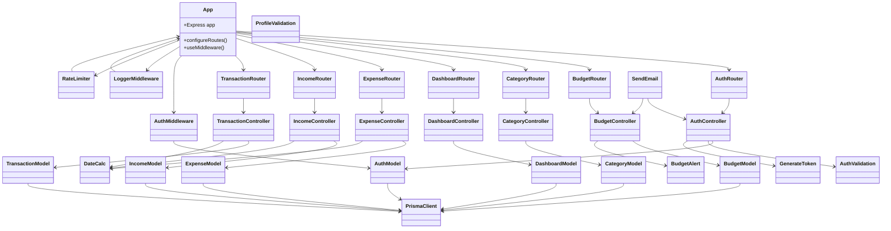

# Structural UML Diagram

## Class Diagram

This diagram provides a structural overview of the main application components in `smart_spend_backend`.

### Notes
- `App` is the root of the server application.
- `Router` modules expose REST endpoints and delegate requests to controller classes.
- `Controller` modules coordinate business logic and interact with persistence models and utility classes.
- `Model` modules interact with the Prisma client to read/write data.
- `Middleware` modules provide request-level features like authentication, logging, and rate limiting.
- `Utils` and `Validation` modules support controllers and request handling.
